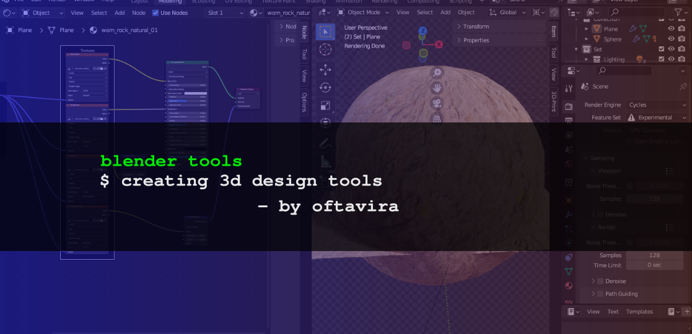

  

# Generating components with scripts

This set of tools aims to generate an easy way to execute scripts to accelerate the process of creating components in Blender and designing tools. For the moment, the script to generate materials to work with (Please visit [Poly Heaven](https://polyhaven.com/)) are given as examples. Please contact the author if you want to contribute to this project or if you want implementation of these tools for your use case.

- Input-Texture coordinate
- Vector-Mapping
- Vector-Normal Map
- Vector-Displacement
- 4x Texture-Image texture
- Shader-Principled BSDF
- Output-Material output
